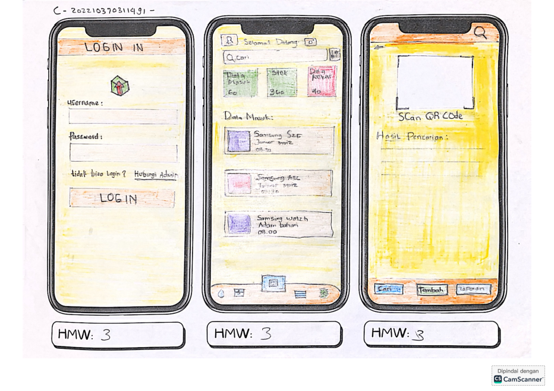
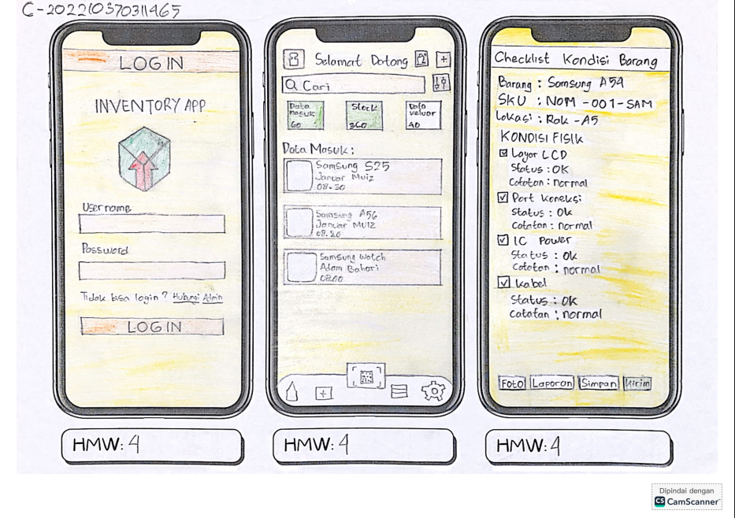

# **Inventory App**

**Inventory App** adalah aplikasi Flutter yang dirancang untuk memberikan pengalaman pengelolaan stok yang lebih modern, cepat, dan akurat. Aplikasi ini membantu pengguna dalam **mencatat, memantau, dan mengelola persediaan barang melalui fitur scan barcode** secara terstruktur sehingga proses operasional menjadi lebih efisien untuk konter service hp

---

Kelas C - 202210370311491 - Ellyas Prambudyas - Ellyas-Prambudyas
Kelas C - 202210370311465 - Januar Muiz Triananda - Januar Muiz
Kelas C - 202210370311509 - Adam Bahari Wiyono - AdamBahari

---

Link Figma : https://www.figma.com/design/iLJ0kZ6V8vcQtAqlSBoOAv/Inventory-App?node-id=0-1&m=dev&t=znMvXiiw1UaQGlCi-1

---

Worksheet : ada di folder worksheet

---

Low Fidelity Prototype :
- Low Fidelity 1
](https://github.com/Ellyas-Prambudyas/inventoryapp/blob/main/High%20Fidelity%20%26%20Low%20Fidelity/Low%20Fidelity%201.png)
- Low Fidelity 2
](https://github.com/Ellyas-Prambudyas/inventoryapp/blob/main/High%20Fidelity%20%26%20Low%20Fidelity/Low%20Fidelity%202.png)
- Low Fidelity 3
](https://github.com/Ellyas-Prambudyas/inventoryapp/blob/main/High%20Fidelity%20%26%20Low%20Fidelity/Low%20Fidelity%203.png)
---

Tabel Tugas (Backlog) : ada di folder pembagian tugas

---

## **Fitur Utama**

### **1. Manajemen Barang**

* Menambahkan item baru dengan detail lengkap.
* Mengubah informasi barang seperti nama, merk, harga, total , supplier, gambar barang , download kode QR .dll

### **2. Pelacakan Stok**

* Menampilkan jumlah stok terbaru secara real-time.
* Memberikan informasi detail produk secara akurat, cukup meng scan barcode.

### **3. Antarmuka Sederhana dan Responsif**

* UI intuitif yang memudahkan pengguna mengontrol dan memahami data.
* Dukungan penuh untuk Android, iOS, dan Web.

---

## **Teknologi yang Digunakan**

* **Flutter** (Dart)
* **Local Database** Hive 
* **Cloud Backend** Supabase

---

## **Cara Menjalankan Project**

1. Pastikan Flutter SDK sudah terpasang.
2. Jalankan perintah berikut:

```
flutter pub get
flutter run
```

3. Pilih perangkat yang ingin digunakan (Android, iOS, atau Chrome untuk web).


---

## **Cara Instalasi & Deploy**

### **Android (APK)**

```
flutter build apk --release
```

File APK akan muncul di:

```
build/app/outputs/flutter-apk/app-release.apk
```

### **Web**

```
flutter build web
```

Hasil build berada di folder `build/web/` dan bisa di-upload ke hosting.

Tampilan awal : 
 


